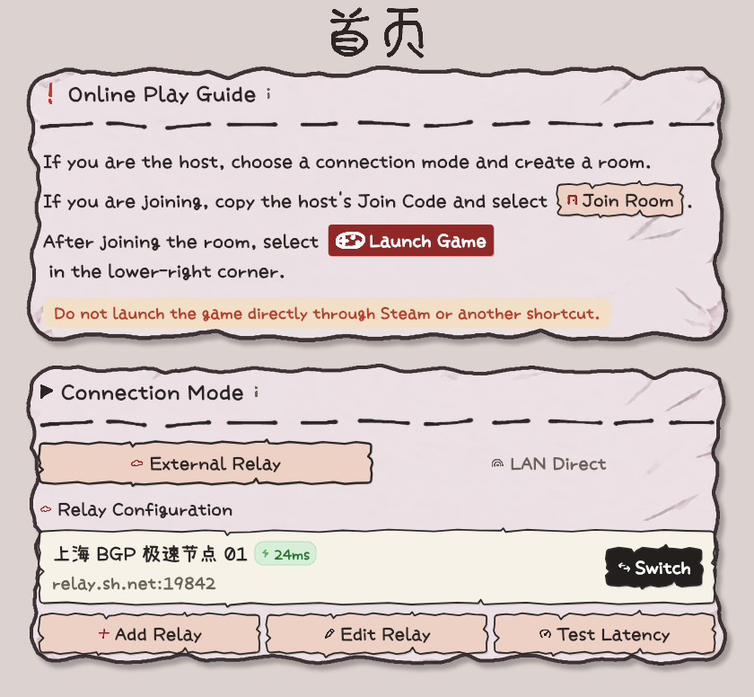
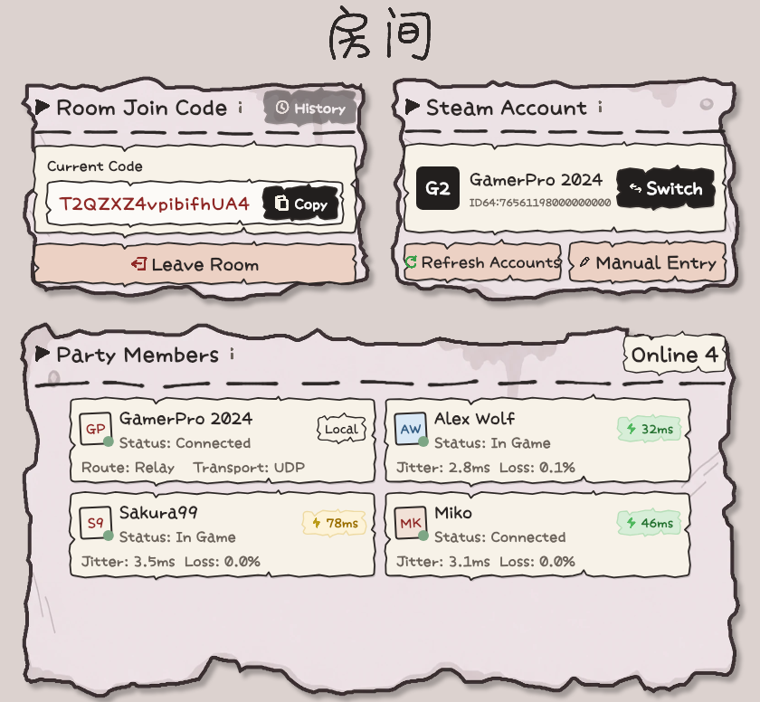
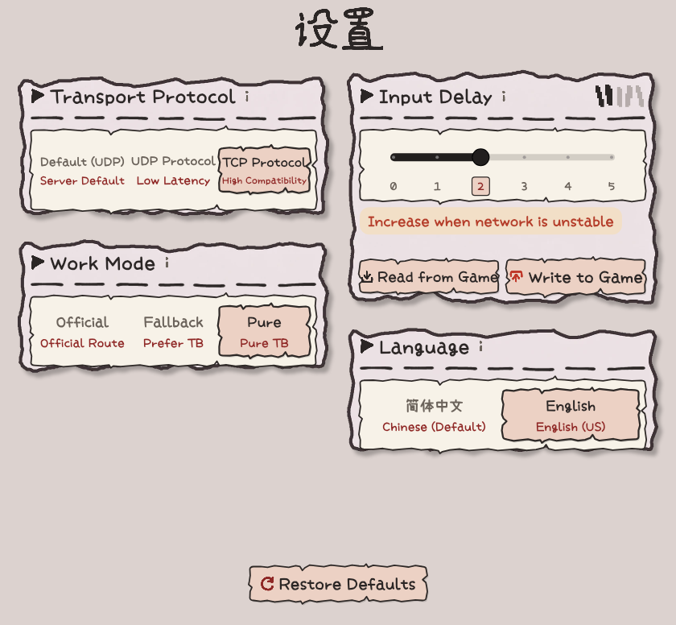
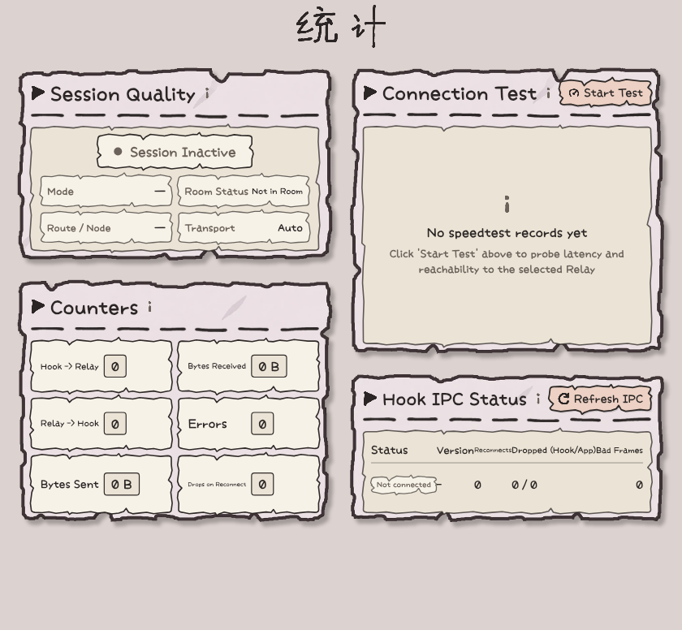
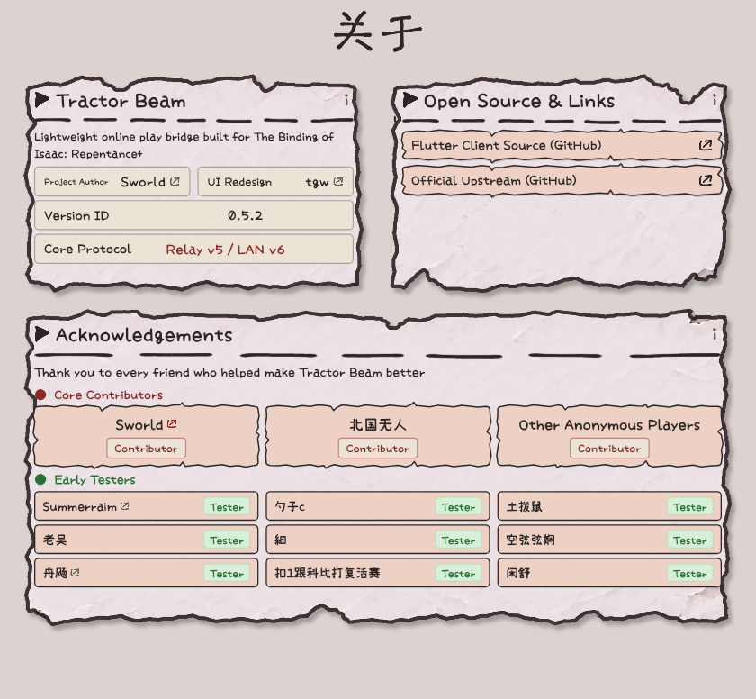

<div align="center">


# Tractor Beam

A desktop Client and Relay Server for improving online play in *The Binding of Isaac: Repentance+*

[English](README.en.md) · [简体中文](README.md) · [Download Releases](https://github.com/tianguantg/TractorBeam/releases)

[](LICENSE)
[]()
[](https://flutter.dev)
[](https://www.rust-lang.org)
[](https://github.com/mcthesw/TractorBeam)

</div>

---

> This repository is a community fork of [mcthesw/TractorBeam](https://github.com/mcthesw/TractorBeam) that adds a Windows x64 Flutter client. Core protocols and upstream implementation remain owned by the original authors. Fork source code is hosted at [tianguantg/TractorBeam](https://github.com/tianguantg/TractorBeam).

When official online play or virtual LAN connections are unstable, Tractor Beam routes game traffic through a Relay while preserving standard Steam features.

## Features

- **Isaac Game Style Interface**: Visual elements and animations aligned with the game style.
- **Compact Monitor Window**: Switch to an always-on-top window during active sessions to inspect latency and packet loss without obstructing gameplay, with instant return to the full window at any time.
- **Dual-Engine Architecture**: Flutter manages presentation and layout, while the Rust native layer handles process injection, encrypted transport, and relay routing.
- **Bilingual and Accessible**: Full switching between English and Simplified Chinese, with keyboard focus navigation and hotkey activation.
- **Diagnostics and Statistics**: Real-time latency evaluation, relay speed tests, packet drop tracking, and diagnostic log export.

## Screenshots

<table>
  <tr>
    <td align="center" colspan="2"><strong>Home</strong></td>
  </tr>
  <tr>
    <td align="center" colspan="2"></td>
  </tr>
  <tr>
    <td align="center" width="50%"><strong>Room</strong></td>
    <td align="center" width="50%"><strong>Settings</strong></td>
  </tr>
  <tr>
    <td></td>
    <td></td>
  </tr>
  <tr>
    <td align="center" width="50%"><strong>Statistics</strong></td>
    <td align="center" width="50%"><strong>About</strong></td>
  </tr>
  <tr>
    <td></td>
    <td></td>
  </tr>
</table>

## Usage

1. Download `TractorBeam-Client-Flutter-Windows-x86_64.zip` from the [Releases page](https://github.com/tianguantg/TractorBeam/releases/latest).
2. Extract all files to a local directory and run `tractor-beam.exe`.
3. Select your Steam account and connection mode (Steam Direct, External Relay, or LAN Direct).
4. The host creates a room and shares the Join Code; other players join using the code.
5. Click **Launch Game**; during play, click the status bar button to switch to the compact monitor window.

## Building

Prerequisites: Rust 1.97.0, Flutter 3.41.6 / Dart 3.11.4, and Visual Studio 2022 C++ desktop development components.

```powershell
# 1. Check Rust crates
cargo check --workspace
cargo test --workspace

# 2. Test Flutter client
cd apps/tractor-beam-flutter
flutter pub get
flutter analyze
flutter test

# 3. Package Windows release bundle
cd ../..
./scripts/package_flutter_windows.ps1
```

The output bundle is placed at `dist/TractorBeam-Client-Flutter-Windows-x86_64.zip`.

## Privacy and Diagnostics

Do not share join codes, session credentials, resume keys, or paths containing personal usernames in public issues or screenshots. If you encounter network issues, export a diagnostic bundle from the client log screen.

## Documentation

- [Architecture Overview](docs/architecture.md)
- [Relay Deployment Guide](docs/relay.md)
- [Relay Configuration](docs/relay-configuration.md)
- [Relay Observability](docs/relay-observability.md)
- [LAN Direct Guide](docs/lan.md)
- [Security Model](docs/security.md)
- [Roadmap](roadmap.md)
- [Contributing](CONTRIBUTING.md)

## License

Source code is licensed under [GNU AGPL v3.0 or later](LICENSE). Third-party fonts and assets are listed in [THIRD_PARTY_NOTICES.md](THIRD_PARTY_NOTICES.md). Upstream copyright remains with original contributors.
