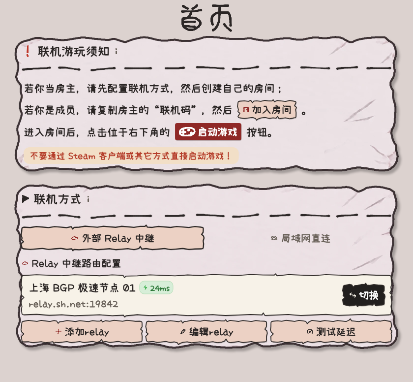
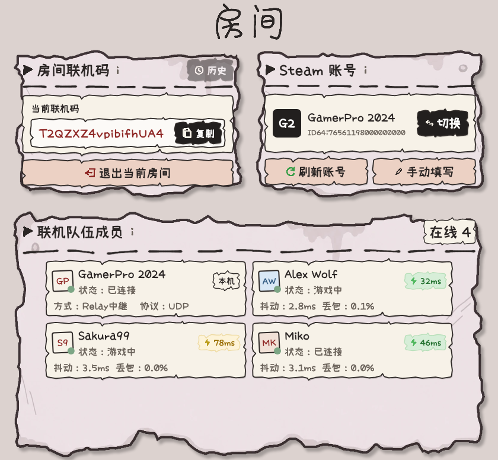
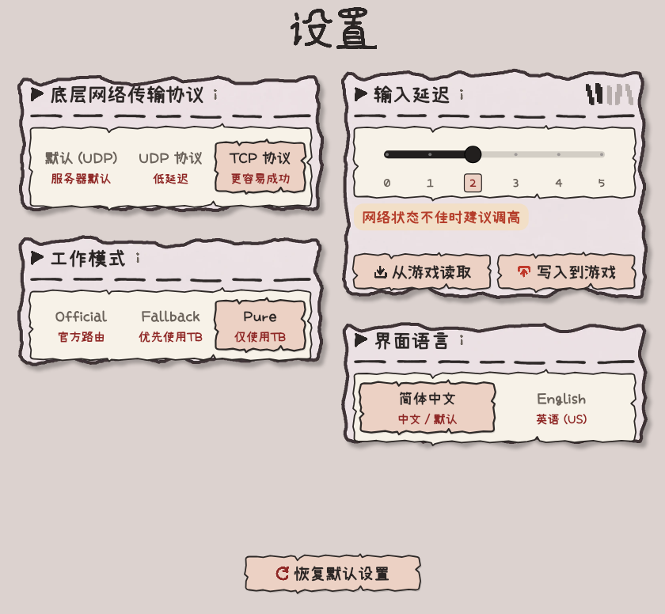
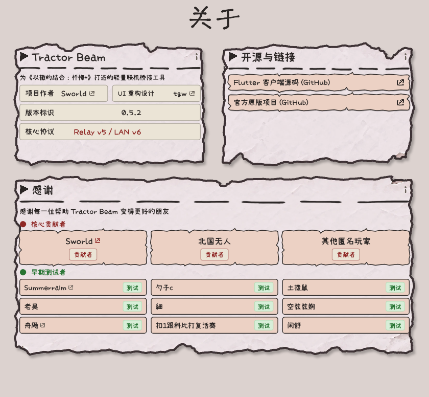

<div align="center">


# Tractor Beam

优化《以撒的结合：忏悔+》联机体验的桌面客户端与 Relay 中继服务

[English](README.en.md) · [简体中文](README.md) · [下载最新版本](https://github.com/tianguantg/TractorBeam/releases)

[](LICENSE)
[]()
[](https://flutter.dev)
[](https://www.rust-lang.org)
[](https://github.com/mcthesw/TractorBeam)

</div>

---

> 本仓库是 [mcthesw/TractorBeam](https://github.com/mcthesw/TractorBeam) 的社区 Fork，新增 Windows x64 Flutter 客户端。核心协议与上游实现归原作者所有；Fork 源码位于 [tianguantg/TractorBeam](https://github.com/tianguantg/TractorBeam)。

当官方联机或虚拟局域网不够流畅时，Tractor Beam 可以将游戏数据通过 Relay 传输，同时保留 Steam 版本的正常功能。

## 核心特性

- **以撒游戏风格界面**：契合原版游戏氛围的视觉元素与交互动效。
- **独立悬浮监控窗**：进入对局后可切换为置顶微型窗口，实时查看玩家延迟与丢包，不遮挡游戏画面，并支持随时切回主界面。
- **双引擎架构**：Flutter 负责界面交互与排版，Rust 原生层负责进程注入、加密通讯与网络中继。
- **双语支持与无障碍操作**：支持中英文无缝切换，提供完整的键盘焦点导航与快捷键激活。
- **网络诊断与统计**：提供实时延迟监测、节点测速、丢包计数与日志导出。

## 界面预览

<table>
  <tr>
    <td align="center" colspan="2"><strong>首页</strong></td>
  </tr>
  <tr>
    <td align="center" colspan="2"></td>
  </tr>
  <tr>
    <td align="center" width="50%"><strong>房间</strong></td>
    <td align="center" width="50%"><strong>设置</strong></td>
  </tr>
  <tr>
    <td></td>
    <td></td>
  </tr>
  <tr>
    <td align="center" width="50%"><strong>统计</strong></td>
    <td align="center" width="50%"><strong>关于</strong></td>
  </tr>
  <tr>
    <td></td>
    <td></td>
  </tr>
</table>

## 使用说明

1. 从 [Releases 页面](https://github.com/tianguantg/TractorBeam/releases/latest) 下载便携包 `TractorBeam-Client-Flutter-Windows-x86_64.zip`。
2. 解压到本地目录后运行 `tractor-beam.exe`。
3. 选择 Steam 账号与联机方式（Steam 直连、Relay 中继或局域网直连）。
4. 房主创建房间并复制联机码，其他玩家通过联机码加入。
5. 点击右下角“启动游戏”；进入对局后可点击状态栏“悬浮窗”切换为置顶监控面板。

## 本地构建

构建环境要求：Rust 1.97.0、Flutter 3.41.6 / Dart 3.11.4 与 Visual Studio 2022 C++ 桌面开发组件。

```powershell
# 1. 检查 Rust 模块
cargo check --workspace
cargo test --workspace

# 2. 检查与测试 Flutter 客户端
cd apps/tractor-beam-flutter
flutter pub get
flutter analyze
flutter test

# 3. 打包 Windows 便携版
cd ../..
./scripts/package_flutter_windows.ps1
```

构建输出位于 `dist/TractorBeam-Client-Flutter-Windows-x86_64.zip`。

## 隐私与诊断

请勿在 Issue、公开讨论区或截图中透露联机码、Session 凭证、Resume Key 或包含个人用户名的本地路径。遇到网络问题时，可通过客户端日志页面导出诊断包。

## 相关文档

- [架构说明](docs/architecture.md)
- [Relay 部署指南](docs/relay.md)
- [Relay 配置说明](docs/relay-configuration.md)
- [Relay 观测说明](docs/relay-observability.md)
- [局域网直连说明](docs/lan.md)
- [安全边界说明](docs/security.md)
- [规划路线图](roadmap.md)
- [贡献指南](CONTRIBUTING.md)

## 许可证

代码采用 [GNU AGPL v3.0 or later](LICENSE)。第三方字体与素材来源详见 [THIRD_PARTY_NOTICES.md](THIRD_PARTY_NOTICES.md)。上游代码版权归原项目贡献者所有。
